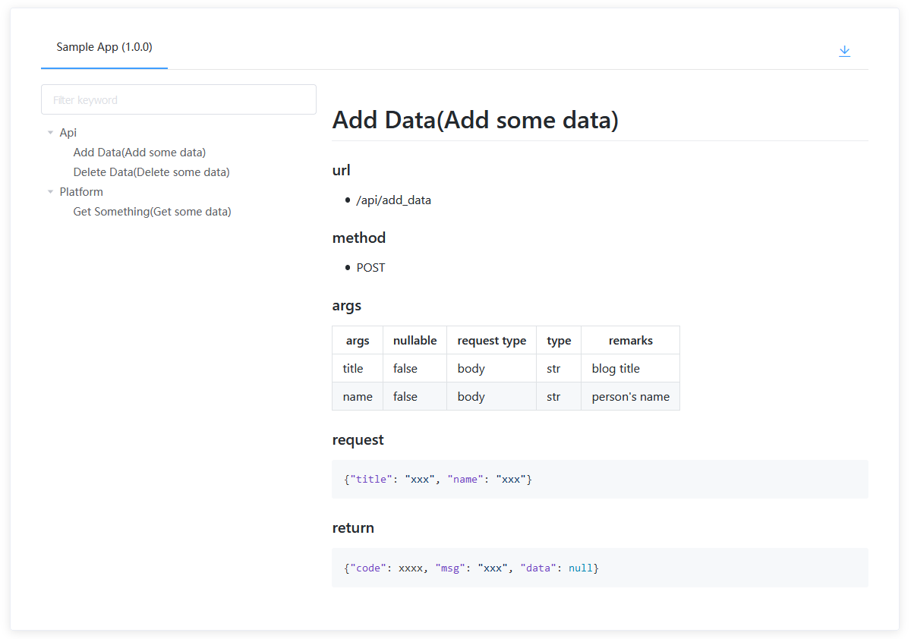
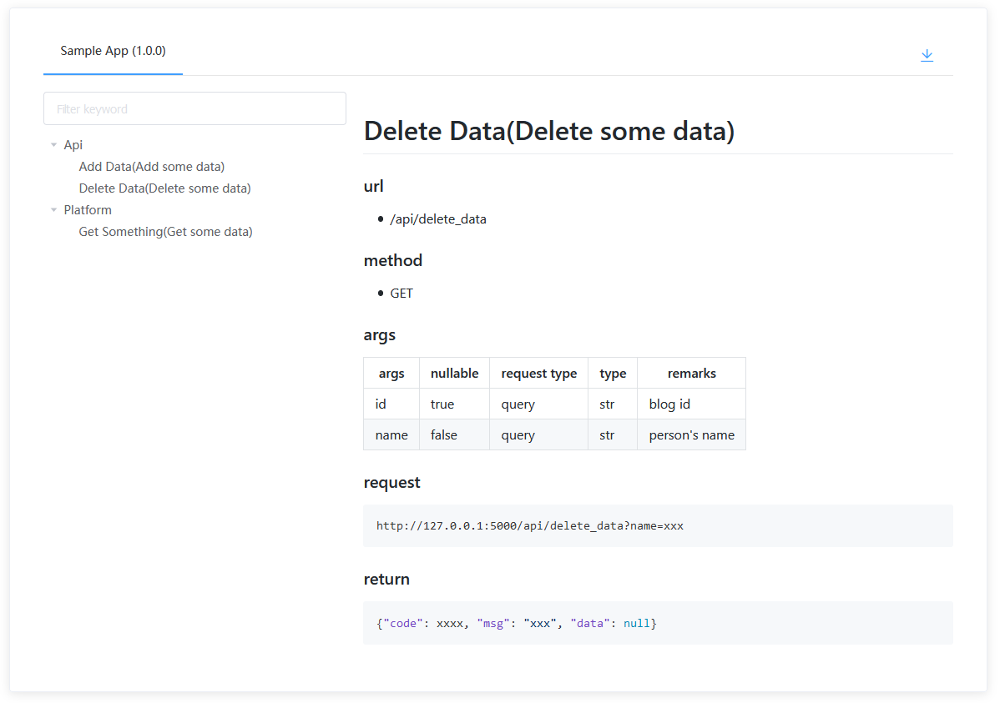
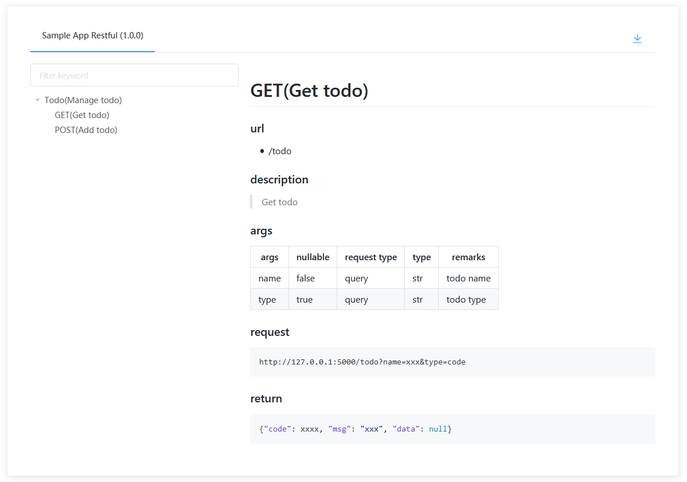

# Flask-Docs

[](https://travis-ci.org/kwkwc/flask-docs)
[](https://coveralls.io/github/kwkwc/flask-docs?branch=master)
[](https://pypi.org/project/Flask-Docs/)

> Adds Docs support to Flask.

[简体中文](README.zh-CN.md)

Features
-----

- Automatic generation of markdown documents
- Support for generating offline documents
- Support Flask-RESTful
- Support flask.views.MethodView

Usage
-----

Here is an example:

```python
from flask import Flask
from flask_docs import ApiDoc

app = Flask(__name__)

# Using CDN
# app.config['API_DOC_CDN'] = True

# Disable document pages
# app.config['API_DOC_ENABLE'] = False

# Api Document needs to be displayed
app.config['API_DOC_MEMBER'] = ['api', 'platform']

# Restful API documents to be excluded
app.config['RESTFUL_API_DOC_EXCLUDE'] = []

ApiDoc(app)
```

How to add markdown documents to the code:
```
@@@
# Write your markdown document here
@@@
```

# Run in /docs/api

Api and document pages
-----

````python
@api.route('/add_data', methods=['POST'])
def add_data():
    """Add some data

    @@@
    ### args
    |  args | nullable | request type | type |  remarks |
    |-------|----------|--------------|------|----------|
    | title |  false   |    body      | str  | blog title    |
    | name  |  false   |    body      | str  | person's name |

    ### request
    ```json
    {"title": "xxx", "name": "xxx"}
    ```

    ### return
    ```json
    {"code": xxxx, "msg": "xxx", "data": null}
    ```
    @@@
    """
    return jsonify({"api": "add data"})
````



````python
@api.route('/delete_data', methods=['GET'])
def delete_data():
    """Delete some data

    @@@
    ### args
    |  args  | nullable | request type | type |  remarks     |
    |--------|----------|--------------|------|--------------|
    |  id    |  true    |    query     |  str | blog id    |
    |  name  |  false   |    query     |  str | person's name |

    ### request
    ```bash
    http://127.0.0.1:5000/api/delete_data?name=xxx
    ```

    ### return
    ```json
    {"code": xxxx, "msg": "xxx", "data": null}
    ```
    @@@
    """

    return jsonify({"api": "delete data"})
````



````python
@platform.route('/get_something', methods=['GET'])
def get_something():
    """Get some data

    @@@
    ### request example
    ```python
    import requests
    url="http://127.0.0.1:5000/platform/get_something"
    try:
        print(requests.get(url).text)
    except:
        pass
    ```

    ### return
    ```json
    {"code": xxxx, "msg": "xxx", "data": null}
    ```
    @@@
    """

    return jsonify({"platform": "get something"})
````


Flask-RESTful Api and document pages
-----

````python
from flask_restful import Resource, Api

class Todo(Resource):
    """Manage todo"""

    def post(self):
        """Add todo

        @@@
        ### description
        > Add todo

        ### args
        |  args | nullable | request type | type |  remarks |
        |-------|----------|--------------|------|----------|
        |  name |  false   |    body      | str  | todo name |
        |  type |  false   |    body      | str  | todo type |

        ### request
        ```json
        {"name": "xx", "type": "code"}
        ```

        ### return
        ```json
        {"code": xxxx, "msg": "xxx", "data": null}
        ```
        @@@
        """

        return {"todo": "post todo"}

    def get(self):
        """Get todo

        @@@
        ### description
        > Get todo

        ### args
        |  args | nullable | request type | type |  remarks |
        |-------|----------|--------------|------|----------|
        |  name |  false   |    query     | str  | todo name |
        |  type |  true    |    query     | str  | todo type |

        ### request
        ```bash
        http://127.0.0.1:5000/todo?name=xxx&type=code
        ```

        ### return
        ```json
        {"code": xxxx, "msg": "xxx", "data": null}
        ```
        @@@
        """

        return {"todo": "get todo"}


restful_api.add_resource(Todo, "/todo")
````




flask.views.MethodView Api
-----
> ***For the time being, only url_rule with the same class name are supported***

```python
from flask.views import MethodView

class TodoList(MethodView):
    """Manage todolist"""

    def put(self):
        """Change the data"""

        return jsonify({"todos": "put todolist"})

    def delete(self):
        """Delete the data"""

        return jsonify({"todos": "delete todolist"})


app.add_url_rule('/todolist/', view_func=TodoList.as_view('todolist'))
```

Examples
-----

[Complete example][examples]

Installation
-----

`pip3 install Flask-Docs`

Reference
-----

[flask_api_doc](https://github.com/tobyqin/flask_api_doc/)

[Flask-Bootstrap](https://github.com/mbr/flask-bootstrap/)

[github-markdown-css](https://github.com/sindresorhus/github-markdown-css/)

[examples]: https://github.com/kwkwc/flask-docs/tree/master/examples
